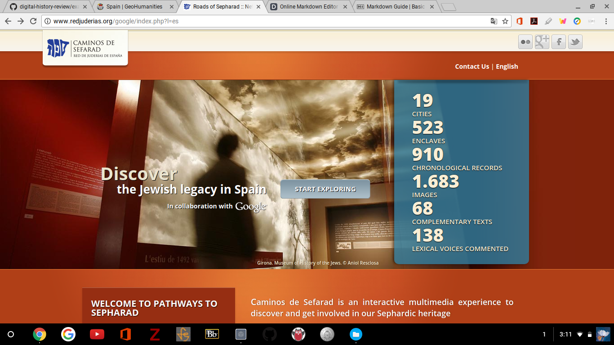
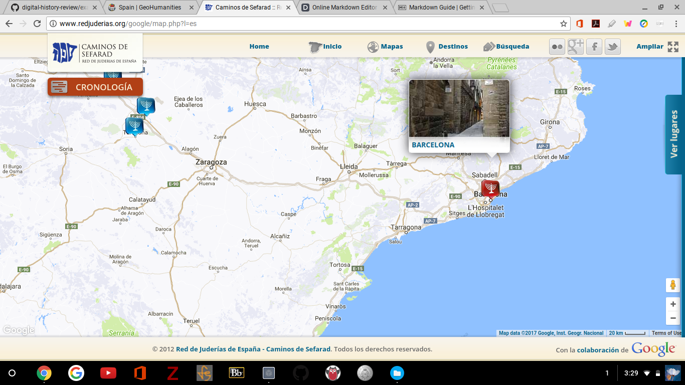
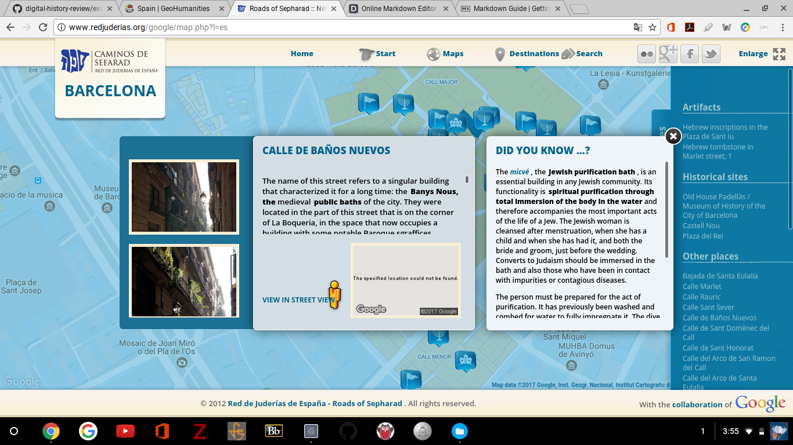
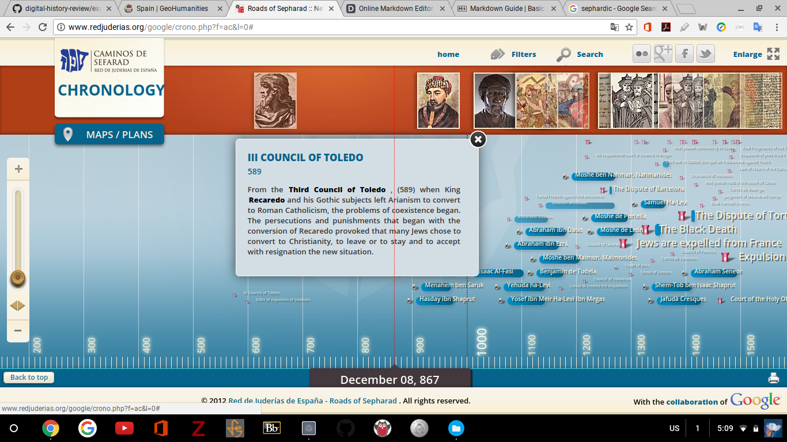

# Spain _Routes of Sefarad_
Digital Review:Desiree' Martinez

<http://www.redjuderias.org/google.index.php>

## What is Redjuderias.org?

Spain _Routes of Sefarad_, is a digital humanities project intended to demonstrate through 500 sites the Jewish heritage and cultural events that occured within the Iberian penisula, particularly Spain. Though the website is enitrely in Spanish, _Camino De Sefarad Red De Juderias De Espana_'s collaboration with Google makes it easy to convert the text to English. And once this is done your met with the the exact number of cities, enclaves, images and text information that you can explore. The site has explored and acquired historical documents and images to provide an interactive experience making the Routes of Sefarad's for anyone looking to explore the rich culture of the Jewish heritage. 

## Navigating the Site

Maps are definitely key to understanding this site. Once entering the exlporatory page, navigation across the peninsula can be accessed by selecting the location you would like to explore. 

For example, if the city of Barcelona was chosen, the enclaves of that Jewish community could be explored by selecting one of the various tabs available. Each tab has an image of either a castle, flag, or menorah which enables access to various artifacts, historical sites, and heritage centers within the space.  This feature can also be accessed by the "View Places" tab on the righthand side of the screen. This allows for even easier exploration due to the highlighting effect that correspondes with each site. Once you have selected your tab for exploration, information regarding the history of that particular location including architectural information is provided. For example, *Calle de Banos Nuevos*, which translates to, *Street of New Bathrooms*, has long been a site used for public bathing starting in 1160 A.D. Throughout the website current images are provided to aid in spatial and visual perspective of the current state of the space being used. However, having more antiquated images of the sites would have further aided in understanding the space at the time of occupation. Nevertheless, additional **"Did you know?"** information is provided on why the sites are special to the Sephardic culture. For example, the Calle de Banos Nuevos,**"Did you know?"** image provides insight into the importance of bathrooms by way of the tradition of *Purification Baths.* 

## Chronology

A chronological timeline is also provided within the map exploration page. Beginning December of 867 A.D. and showing a last entry date of 1968, the *Official Repeal of the Edict of Explusion of the Catholic Monarchs*. Each date is accompanied with images detailing the significant events that effects the Jewish community. For example, July of 1492 correspondes with the date that Jews were expulsed from Spain. An image of the decree is viewable along with the history behind the signing of this document. 

## Want to find out more?!

There are various ways to explore the maps and information provided. The interface allows to begin at the **Start**, which lists all the cities with Sefaradic significance within the Iberian Peninsula. The **Maps** option allows for different formates of the maps to be viewed. For example _aerial_ views will demonstrate the terrain of the landscape while _relief_ view will demonstrate the elevations of the region. The **Destinations** tab can be selected providing a list of individual cities that can be enabled to explore. Lastly, the **Search** tab can be selected which will provide the option to explore sites based on specific characteristics, like whether the site is historically or culturally significant or both. The "current" conditions of the site is also explorable. For example, you can view whether a site has been restored or reused. The exact number of sites corresponding to this criteria is also provided. For instance, there are 18 restored sites and 37 reused site within the region. Additionally, *Google Street View*, is provided as an exploratory option however, when attempting to access the link, the street view is unaccessable. However, exact addresses of all locations are provided to look up individually on *Google Maps*. 

## Conclusion

Redjuderias.org, provides a comprehensive and interactive view of the Jewish history within the Iberian Peninsula. This site delivers an easy navigation between maps and information which allows for accessibility of all ages. Furthermore, access to the **Text Only Version**  at the bottom of the mainpage allows for printability and a more comprehensive visability of the website. Those who are uncomfortable with the navigation process of the main interface will enjoy this feature. The **Bibliographic Sources** tab enables easy accessibility to all sources which is helpful for additional research or inquiry. Having said that, the only interactive feature that was not accessable was the  _Google Street View_. Though you could obtain the site address by dragging your cursor over the street view, not having the direct link may provide a bit of a hassle for those who wish to obtian a spatial visualization. Nevertheless, this is an excellent site for academics, historians, or any person who wishes to tour the sites, history, and traditions of the Jewish heritage of this region. 

 
