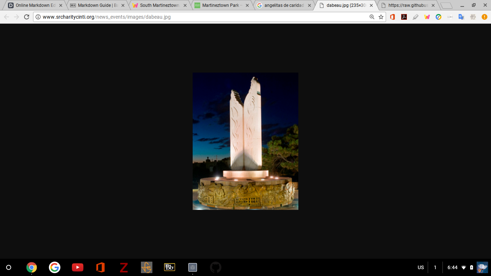
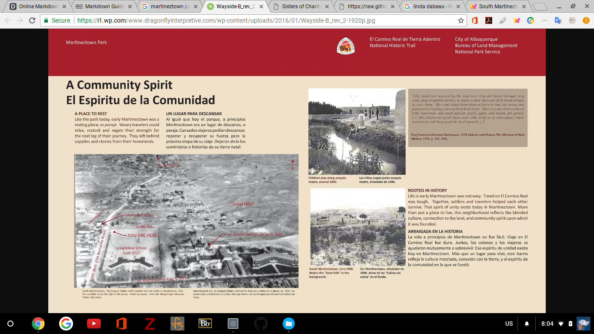

# *Angelitas De Carido*
## "Angels of Charity" Sculpture at Martineztown Park 
Desiree' Martinez

Digital Project Review

Mr.Gibbs

**Martineztown Park** is situated at the crossroads of Lomas Boulevard and Edith Boulevard on the east side of downtown Albuquerque along the famous _El Camino Real_, The Royal Road. However, hidden in the east side of the park near High St. is a sculpture dedicated to the *Sisters of Charity of Cincinnati*, *"Angelitas De Caridad"* by Linda DaBeau. If you were unfamiliar with Albuquerque and its unique history like me, you may have not known that this park or sculpture existed or that there was a story to tell. Encompassed by the urban sprawl of the central business district Martineztown Park is a hidden gem within one of Albuquerque's oldest neighborhoods. And the *Angelitas De Carido* sculpture gives an insight into Albuquerque's special relationship with its residents and landscape. 

## History of Martineztown

Martineztown is located directly on the The *El Camino Real.* This 1,600 miles long trade road was established by the Spanish in 1598 A.D. to connect political and economical interest from Mexico City to the San Juan Pueblo, 25 miles north of Santa Fe. However, it is important to note that this area had long been inhabited by the Native American Pueblos of the region for centuries prior to European contact. The land sits upon sandhills and were surrounded by pastured lands that were used by prominent families of *Old Town* Albuquerque located 2 miles west. This land was perfectly situated for breathtaking views that allowed for views of mountains, mesa, and volcanos. In 1850 Don Miguel Martin established a permanent settlement of adobe homes along the *Acequia Madre de Los Barelas*. This irrigation ditch is no longer in use today but can still be seen today by its commemorative walkway which connects Edith to Broadway Boulevard. 
There were very few businesses at this time and in 1880 the Atchison, Topeka, Santa Fe Railway was established and forever changed the landscape of Martineztown and Albuquerque. The railroad urbanized the city and an influx of businesses and people followed. In 1890 The First Ward School was created, St. Joseph's Sanitarium followed in 1902, and Longfellow Elementary School in 1920. Not only did the railroad bring tourist to the "Wild West" but also brought Turberculosis "Lungers" victims looking for cures in the dry New Mexico desert. 

## The Sisters of Charity of Cincinnati
Founded in 1809 by Elizabeth Seton in Maryland and later moved to Cincinnati under the leadership of Margaret George, is a Catholic group of women who conduct missionary work around the country. As people poured into New Mexico looking to cure their ailments, in 1902 under Sister Blandina Segale the Sister of Charity opened St. Joseph's Sanitarium, present day Lovelace Hospital, which was turned into a hospital for Turberculosis. It is reported that by 1913 that 20-60% of families had one person with consumption. Therefore, this became one if not the only facility to treat pulmonary disease in the Southwest. The Sisters of Charity aided the community of Martineztown and continued their charity work which included orphanages. And in 2002 when the hospital was sold it was voted that these couragous women should be honored for their 100 yrs. of dedication to the community. In dedication the sculpture *"Angelitas De Caridad"* or "Angels of Charity" can be viewed sitting below the hill of Lovelace Hosptial. 

## *"Angelitas De Caridad"* Sculpture
Commissioned by the South Martineztown community and created by Albuquerque artist Linda DaBeau, it is a limestone winged angel standing at 25 feet tall and 16 feet wide with a bronze wrap around fountain base. Though it is situated in Martineztown Park and below the hill of Lovelace, the site itself is nestled away along the curving road of High St. enclosed by trees and flowers making it an almost hidden location within the urban surrounding. Adobe homes line the north and west blocks referencing its Hispanic roots. Once you walk up to the scuplture the beauty and effort put into this area begin to truly amaze. The white limestone wings stands out against the green and brown of the trees. Along the bronze base are depictions of the Sisters of Charity begining with founder Elizabeth Seton and depicts a narrative style, with each scene illustrating the charity work conducted within the community and progression of the hopsital. Walking around the base each cardinal direction displays a plaque with words like Hope, Temperance, and Faith which are in both Spanish and English. The last plaque which is in line with Lovelace Hosptial and the sculpture state, "In Unity There is Strength". This message defines the Sisters of Charity and the unity brought to the commumnity of Martineztown and Albuquerque.

## Conclusion
Martineztown Park *"Angelitas De Caridad"* is a hidden gem of Albuquerque History. When looking on the city website there is little to no information regarding the sculpture. However, the sculpture represents an era in American history and Albuquerque history when the city shifted to a truly urban character.  

### References
http://www.srcharitycinti.org/news_events/images/dabeau.jpg

<chrome-extension://cbnaodkpfinfiipjblikofhlhlcickei/src/pdfviewer/web/viewer.html?file=https://www.cabq.gov/planning/documents/SouthMartineztownSDP.pdf>

<https://i1.wp.com/www.dragonflyinterpretive.com/wp-content/uploads/2016/01/Wayside-B_rev_2-1920p.jpg>

<chrome-extension://cbnaodkpfinfiipjblikofhlhlcickei/src/pdfviewer/web/viewer.html?file=https://dspace2.creighton.edu/xmlui/bitstream/handle/10504/85176/Lawlor_Sr.%20Catherine%20Miriam-MA-1938.pdf?sequence=1>

<http://newmexicohistory.org/places/albuquerques-20th-century-suburban-growth>

  
