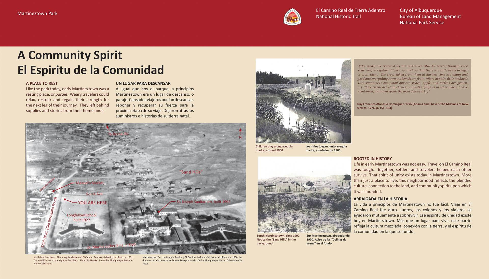

---
---

# *Angelitas De Carido*
## "Angels of Charity" Sculpture at Martineztown Park
Desiree' Martinez

Encompassed by the urban sprawl of the central business district, *Martineztown Park* is a hidden gem within one of Albuquerque's oldest neighborhoods. The park is situated at the crossroads of Edith Boulevard and Dr. Martin Luther King Jr. Ave on the east side of downtown. Surrounded by Spanish Adobe homes, the historic Longfellow Elementary School, and Lovelace Hosptial, it is easy to see how this park may be overlooked by Albuquerque natives let alone tourist. However, it is once you venture into the park you begin to discover the areas rich history. 

Starting at Dr. Martin Luther King Jr Ave. walking north down into the park, you are transported back to the city's orgin through a series of displays that chronicle Native orgin, Spanish conquest, and community intergration. Plaques of Native trees, plants, and animals are distributed every few feet trying to giving a sense of what the landscape would've looked like prior to European contact. And once you reach the center of the park, laughter from the Longfellow Elementary School and noise from the busy streets can be heard. However, continue east into the park and you will experience quite and tranquility.  

Neslted peacefully in the corner of the park at the bottom of the hill with Lovelace Hosptial as the backdrop sits the sculpture, *"Angelitas De Caridad"* by Albuquerque artist Linda DaBeau. Though the sculpture feels hidden, its white limestone wings stands out amongst its surrounding. Dedicated to the *Sisters of Charity of Cincinnati* came to New Mexico at the height of the Tuberculosis epedemic and aided the community by transforming St. Joseph's Sanitarium into present day Lovelace Hospital. Tuberculosis had killed more Americans than any other disease and continues to be one of the deadliest disease in the world. *"Angelitas De Caridad"* sculpture beautifully illustrates the history of Martineztown and the significant role the "Angeles of Charity" played in our states history.

## History of Martineztown

The Rio Grande Valley had long been inhabited by the Native American Pueblos of the region for centuries prior to European contact. However, when the Spanish established the 1,600 miles long *El Camino Real* in 1598, New Mexico became a center of political and economical interest for the Southwest. Prominent families of *Old Town* Albuquerque used Martineztown's sandy hilltop as a lookout for their pastured lands. And in 1850 Don Miguel Martin established a permanent settlement along the *Acequia Madre de Los Barelas*. Though this acequia or irrigation ditch is no longer in use, a commemorative walkway which connects Edith to Broadway Boulevard can be observed.

In 1880 the Atchison, Topeka, Santa Fe Railway was established and forever changed the landscape of Martineztown. As the Railroads urbanized cities across the country, New Mexico offered something different, solace for TB victims who relied on the desert air. As the influx of people accelerated the once farm land of Martineztown became a hub for new business ventures. In 1890 The First Ward School was created, St. Joseph's Sanitarium followed in 1902, and Longfellow Elementary School in 1920. These business would eventually enclose Martineztown Park to its current position, thus creating an oasis within the cityscape.  

## Who were _The Sisters of Charity of Cincinnati_?

Founded in 1809 by Elizabeth Seton in Maryland and later moved to Cincinnati under the leadership of Margaret George, is a Catholic group of woman who aid in missionary work around the country. In 1902 as people poured into New Mexico looking for a cure to Tuberculosis, Sister Blandina Segale of the *Sister of Charity* opened St. Joseph's Sanitarium, present day Lovelace Hospital.The santiarium was turned into a hospital as the number of Turberculosis victims increased. The hospital became one if not the only facility to treat pulmonary disease in the Southwest. The Sisters of Charity aided the community for over 100 years and expanded their work to include orphanages. In 2002 when the hospital was sold, the community came together to dedicate the sculpture *"Angelitas De Caridad"* or "Angels of Charity" to the brave Sisters. Now *"Angelitas De Caridad"* can be viewed sitting below the hill of Lovelace Hosptial.

## *"Angelitas De Caridad"* Sculpture

Commissioned by the South Martineztown community and created by Albuquerque artist Linda DaBeau, the sculpture is a limestone winged angel standing at 25 feet tall and 16 feet wide with a bronze wrap around fountain base. Though it is situated in Martineztown Park and below the hill of Lovelace, the site itself is nestled away along the curving road of High St. enclosed by trees and flowers making it an almost hidden location within the urban surrounding. Adobe homes beautifully line the north and west blocks referencing its characteristically Hispanic roots. However, it is once you walk up to the scuplture itself that you witness the beauty hidden away in the space.  
The white limestone wings stands out against the green and brown of the trees. Along the bronze base are depictions of the *Sisters of Charity* and as artist Linda DaBeau suggests should be viewed in a narrative style. Thus, each scene illustrates the charity work conducted within the community and progression to the formation of the hopsital. Walking around the base each cardinal direction displays a plaque with words like Hope, Temperance, and Faith which are in both Spanish and English. The last plaque which is in direct line with Lovelace Hosptial state, "In Unity There is Strength". This message defines the motto of not only *Sisters of Charity* but what they brought to the commumnity of Martineztown and Albuquerque.

## Conclusion
Martineztown Park *"Angelitas De Caridad"* is a hidden gem of Albuquerque History. When looking on the city website there is little to no information regarding the sculpture. However, the sculpture represents an era in American history and Albuquerque history when the city shifted to a truly urban character.  

### References
http://www.srcharitycinti.org/news_events/images/dabeau.jpg

<chrome-extension://cbnaodkpfinfiipjblikofhlhlcickei/src/pdfviewer/web/viewer.html?file=https://www.cabq.gov/planning/documents/SouthMartineztownSDP.pdf>

<https://i1.wp.com/www.dragonflyinterpretive.com/wp-content/uploads/2016/01/Wayside-B_rev_2-1920p.jpg>

<chrome-extension://cbnaodkpfinfiipjblikofhlhlcickei/src/pdfviewer/web/viewer.html?file=https://dspace2.creighton.edu/xmlui/bitstream/handle/10504/85176/Lawlor_Sr.%20Catherine%20Miriam-MA-1938.pdf?sequence=1>

<http://newmexicohistory.org/places/albuquerques-20th-century-suburban-growth>
