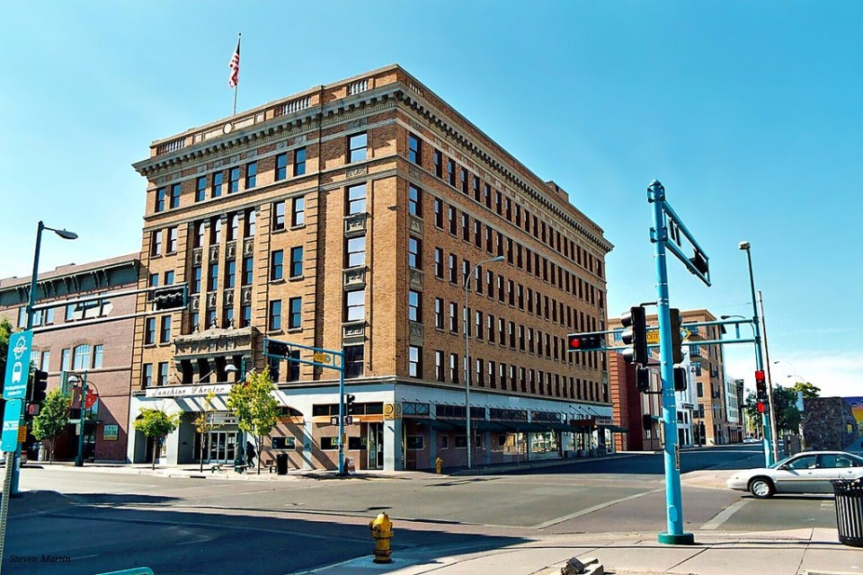

---
---


Enjoying a *Marble Brewery Pale Ale* while watching a reggae, hip-hop, or rock concert at Sunshine Theater is an experience that most people fail to appreciate for many reasons. First, some locals may think that the venue quality in the Sunshine Theater is not as good as other venues downtown. Second, the aging facade also could be considered an eye sore to some locals. Third, many don't have any other historical knowledge about the building besides the use of a concert hall by locals. As Albuquerquens, it is our duty to carry the history of our city in to the future as well as to remember all the places that make up and have made up our city skyline; so, this essay is an attempt to give a greater understanding to importance of the Sunshine Building to the local community as well as visitors to Albuquerque.

### History

The Sunshine building is most famously known to some as "Albuquerque's original cinematic palace [1]." However, in order to appreciate the full historic context of the building, it is important to look at the influence that the building of the Sunshine "theatre" had on the history of Albuquerque besides being one of the city's first movie theaters. Before the Sunshine building was built it was located on what was known as The White Elephant which was a saloon that closed down, due to prohibition, in 1920 [7]. The saloon was owned by Joseph Barnett who moved to New Mexico from New York in 1883 and was involved in real estate until he eventually became a local entertainment entrepreneur that, at one point, owned most of the city's theaters. Barnett, who hired noted architect Henry C. Trost of Trost & Trost in El Paso to build Sunshine Theatre which would include a 920 seat theater and would become the second sky scraper in downtown Albuquerque [8].

The theater was built in "a symmetrical Beaux Arts style not unlike the detailing that its architect Henry Trost had given to the new bank, a block west on Central Avenue" and "incorporated into a two-part vertical block, the theater’s marquee and entry provided a visual base to the building with the five story vertical shaft rising above to the decorative cornice capping the building [8]." In addition to the building was the 'Route 66'themed neon Sunshine sign which added to the buildings facade and created the classic 1920's feeling when visiting the theatre. Another notable historical fact in the building of the 'Sunshine theatre' is that Trost also pioneered the use of reinforced concrete within southwest construction techniques which he then covered with the yellow brick facade that still currently exists today. Also, the building included an attendant operated elevator used for patrons viewing the from the balcony of the 'theatre' which is what gave the building historic value, along with the oak lobby boasts and facade, when it was registered for the National Registrar of Historic Places in 1985 [7]. The theatre opened its doors on May 1, 1924 with the showing of "Scaramouche" featuring actor Ramon Navarro and included a live orchestra to accompany the silent black and white film.

The building also includes offices on the upper levels of the building that housed F.D. Fogg and Company, a fine jewelry retailer that closed in 1970 and was also the site of the first meetings of Congregation B’nai Israel which connects the building to history of the current day New Mexico Historical Jewish Society [9]. The theatre continued to show films in to the 1960s when the interior was almost completely remodeled to allow an installation of a large movie screen for feature film screenings. Sunshine remained in operation until 1974 when the theatre stopped showing first-run movies but then eventually closed its doors as a movie theatre in 1980 and was seriously threatened with demolition in 1984 [6]. The efforts to save the iconic Sunshine building were finally appeased when the city declared it as a historic landmark in 1985. The final renovation to the building came in 1990s when the theatre was renovated its current day purpose in the downtown which is a live music performance venue and has hosted some well-known acts such as: Strokes, Snoop Dogg, Stone Temple Pilots, The Smashing Pumpkins, Modest Mouse, Rancid, Coheed and Cambria, Social Distortion, Deftones, Deadmau5, and many others.

### Sushine Building Today

Today, a quick drive by the Sunshine building or a google search on Google maps will reveal that it is now mostly known to the public, specifically to the youth as an one of the few underage venues, as a concert stage for artists visiting Albuquerque. Another quick search on google will also reveal yelp reviews of the venues current condition which include: sound quality in theater being really bad, the restrooms to be falling apart with little to no maitennece by building staff, the venue layout being too small for crowds that tickets sales allow, and most importantly the customer service given by staff, bartenders, and security in the venue was by far the most commented on. One review, from a resident that moved to Albuquerque, praised the small venue sized becuase it was much ore of an intamate setting...  

### Sushine Building in the future

under construction due to last weeks readings :)....

### *References*

1. https://www.cabq.gov/planning/boards-commissions/landmarks-urban-conservation-commission/historic-landmarks

2. http://www.city-data.com/articles/Sunshine-Building-Albuquerque-New-Mexico.

3. http://cinematreasures.org/theaters/10528

4. https://en.wikipedia.org/wiki/Sunshine_Building

5. https://www.flickr.com/photos/stevenm_61/34813178582

6. http://www.henrytrost.org/buildings/sunshine-theatre-and-office-building/

7. http://www.historicabq.org/sunshine-building.html

8. http://www.nmhistoricpreservation.org/assets/files/historic-contexts-and-reports/Movie-Theaters-in-New-Mexico-MPDF-Final-Sent-to-NPS.pdf

9. http://nmjhs.org/2014-conference/

10. http://rjbuffalo.com/sunshine.html

11. http://sunshinetheaterlive.com/page/about-sunshine-theater

12. https://www.yelp.com/biz/sunshine-theater-albuquerque

