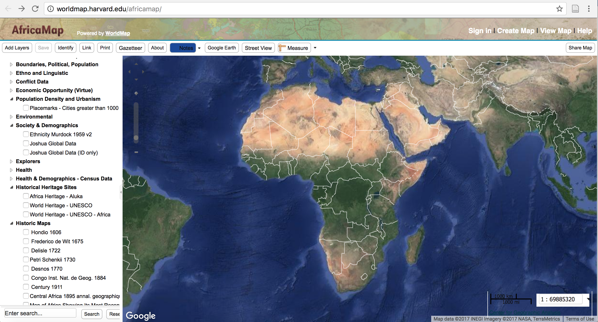

###### James Gleason
###### 10/10/17
###### Hist. 300
# Digitally Mapping Africa
#### Introduction
*AfricaMap* is a mapping project stored at the Center for Geographic Analysis at Harvard University and supported by the W.E.B. Du Bois Institute, the Department of African and African American Studies and the Committee for African Studies at Harvard University. This digital map is designed to allow users to visually place various layers representing social, poltical, and economic data onto a map of Africa to portray conditions at various points thoughout history.

#### Interface
All of the esssential material of *AfricaMap* is contained on the home page. The digital map used for the project is Google Maps and therefore should feel familiar to most users. This familiarity along with the simplistic design of the page should feel accessible to a wide-range of users. The left side of the map lists each layer by subject. The subjects include; topographical features, trade routes, boundaries (political and population), ethnic demographics, lingusitic demographics, health information, conflict information, historical maps, and slave trade information, just to name a few. The problem is that these subjects are listed in no particular order. A user who is searching for a layer related to "Society & Demographics" may be surprised (or annoyed) to find it sandwiched between the subjects "Environmental" and "Explorers". Displaying a layer on the map simply requires the user to click on its corresponding box. Displaying multiple layers simultaneoulsy is possible, but can make the map appear cluttered. This issue will depend on which layers the user is attempting to show simultaneously and can only be avoided by displaying each layer one at a time. The map is entirely customizable, allowing layers and corresponding information to be added and shared with other people. This level of customizability could be of use to more advanced and dedicated users. 

The layers themselves are a mixed bag in terms of clarity and usefulness. For instance, the "Language Family" layer gives a color cordinated regional breakdown of the different languages spoken across the continent. This layer is clear and concise in correlating the language family to areas on the map, and could be a useful auxilary source for an interested user. Other layers, like "Slave Trade Leg 2- By Nationality", are entirely incomprehensible. Each line of the layer has a color with a corresponding country, but absolutely no context is given as to what the user is actually looking at. Are these lines trade routes? When were these routes taken/used? How many slaves were on each route? For every useful layer like the "Language Family" there is a useless layer like the "Slave Trade Leg 2- By Nationality".

#### Sources
The data for the map is aggregated from a wide variety of sources. Hovering the mouse over a particular layer gives a brief overview of where the corresponding information for the layer comes from and sometimes provides a link to the website that contains the source itself. Inexplicably, some layers have neither a link or an overview of exaclty who, what, when or where the source was derived. For example, the layer "Trade Routes" provides no overview or link for the source, simply stating "No Abstract Provided".  Furthermore, the layer itself is incomprehensible because it places a giant white square over the surface area of Africa and gives random line and plot points without any context as to what they are meant to portray. Reliability of the sources can also vary at times. For instance, the information gathered from the various United Nations programs, like the UN Economic Commission for Africa, can be easily retraced to ensure its reliabilty. Other sources can vary from being entirely untraceable, and therefore not reliable, to being suspect in terms of their origin. For instance, the Joshua Project is used as a source for the "society and demographic" layer. Further investigation reveals that the Joshua Project is a Christian Missionary project aimed at spreading Christianity throughout the underdeveloped world. A source with such a clearly defined political agenda may be problematic in terms of the reliability of the information it is sharing.     

#### Conclusion
*AfricaMap* attempts to provide a starightforward mapping project that allows users to visually represent data related to various social, poltical, and economic subject areas. The practicality and simplicity of the project is diminished by the fact that half of the layers are ineffective if not completely useless. The layers that are functional can provide adequate supplementary information depending on the subject area that users are interested in. Determining which layers are functional and which are not is a hit-or-miss process. Whereas most layers under the "Ethno and Lingustics" subject function properly and provide great visuals, other layers like those under "Trans-Atlantic Slave Trade Database" are useless. Overall, *AfricaMap* provides limited supplemental information that does little to push the envelope of digital scholarship.
