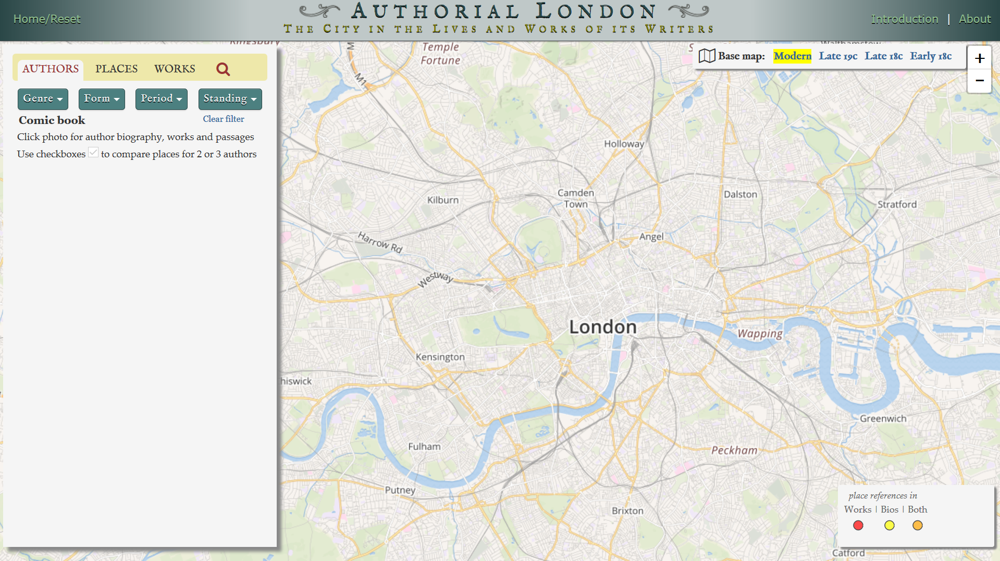
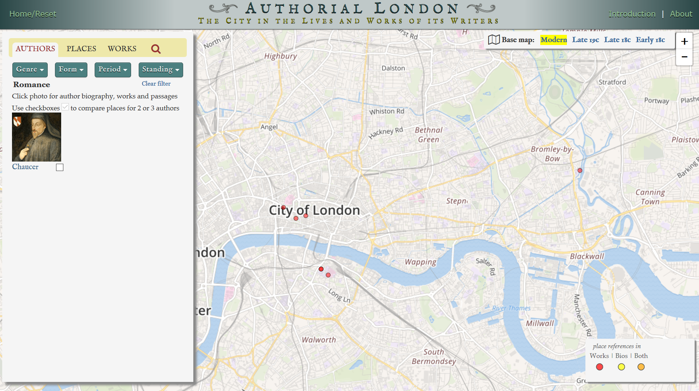

# Mapping Project Critique- [Authorial London](https://authorial.stanford.edu/)
by Merin Rodgers

> Authorial London is a Spacial History Project focusing on Authors and their works in London between the 14th and 20th century. This project was created for researchers and instructors to use as both a teaching and investigative tool. With this in mind the creators, Mark Evans (English Professor at Stanford University), Kenneth Ligda, Karl Grossner,and David McClure (All PhDs working in the Stanford University Libraries) have designed the project around a modern day map of London, (with options of 19th and 18th century maps) and to the left you can search the database by author, works, or a place (neighborhood).

There are three main sections of the project that I think are worth mentioning in more detail. Those being the Maps, Design, and the Database itself. 
#### Maps
This project was a massive undertaking by the creators, in order to create the corpus they analyzed 1,600 passages from 47 authors between the 14th and 20th century. To organize the corpus the creators organized the locations based off a modern day map, but they also have functions for both a 19th century, late 18th century and early 18th century map. Giving the user the option of referencing a map from the time the author was prevalent. 

#### Design
In *Place, Memory, and Urban Preservation* Casey states that "images are 'much better retained than abstract items.'" It's disappointing that Evans, Ligda, Grossner and McClure didnt take this more into account. They don't really include any photos of the actual area's these Authors (and their work) are tied to, only  brief photo of the author and possible one or two photos of the places they lived. 

As you open the project an introduction pops up, with a video of (assumingly) one of the creators walking you through how to use the project. Even with this introduction (if you even decide to watch it) the database's design is still difficult to understand, including forms or genres with either zero or only one example of an Author or work under that section, for example: 

They also separate both Genre and Form making it misleading, having a section such as Letters under Genre instead of Form, which you can jusifiably argue is a category under both sections. 

#### Database
The creators of the project touch on the fact that this is not a complete archive of each Authors work or of even all the authors from the area, but there are some glaring limits to this database. 

First, the database has only about eight female authors. I am sure, or at least I'd hope this wasn't an intentional oversight, but to have less than a fifth of the corpus be female is a huge oversight, and mind you this oversight is including infamous authors like Jane Austen, and the Bronte sisters who had either lived in London for brief periods of time or wrote about them.

However the corpus does include John Milton, who to be fair was praised as one of the greatest Englis authors, but he wrote almost completely in poetry and prose writing exclusively on personal conviction. His work hardly ever mentions specific places around London, in fact the corpus shares almost fifteen places imporant to his life, but only one example found in his work. 

As a fan of female writers of the time, this under representation is very frustrating. 

Second, the database has an obvious (hopefully accidental) bias to some genres. For example, Satire vs. Romance:

It highlights the overal bais the creators seem to have towards the authors they are selecting but it could also just be a side effect of the small corpus.

#### Validity
As far as I can tell the database hasn't been updated in awhile, the creators use words such as 'presently' to describe the creation and their undertaking. It was originally created in 2011 and based off the about page, specifically speaking on the amount of authors in the corpus, there hasn't been an update in about six years. 

However, the authors do speak on how the database was created as far as geotagging the corpus. They also mention fixing the georeferencing  when the 'machine' reference the wrong location due to wording. They don't include what 'machine' they used as far as the algorithm though. 

#### Final Thoughts
Overall, project is helpful but the corpus is too small, which leads to an overal skeptism of the project as a whole. 
