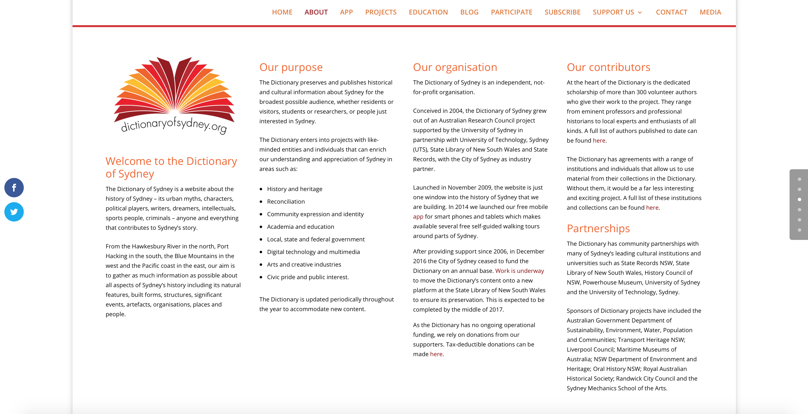
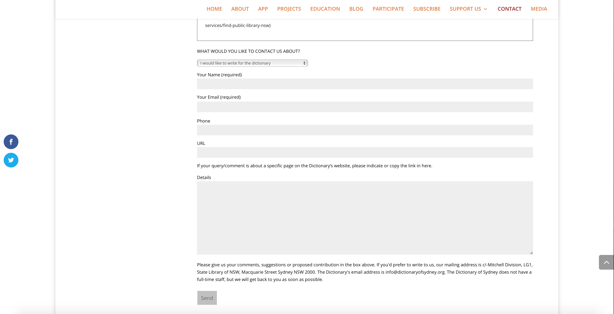

# Dictionary of Sydney

The purpose of the dictionary of Sydney website is to act as a repository for Sydney’s collective historical and cultural story for as broad of an audience as possible regardless of socioeconomic status and actively updating the repository with new information about Sydney throughout each year. The features/functionality of the website consist of navigation tabs, a search tool bar, browsing bubbles that have guided content, a blog, projects, links to support the website or find information, and pictures with descriptions.

## Interface

The search tool bar and browsing bubbles with guided information (e.g. the category places) work well together to assist users in finding relevant information. One way the browsing bubbles compliment the search tool bar is when a user does a search (i.e. a question, term, name, etc.) they do not have to go back to the home page to access the browsing bubbles, as they’re present with the results from the search for easy access. Additionally, each search is laid into two columns that show the title and the type of classification for each result, which can help the user get a sense of what each result will be in relation to.

The presentation of the website is well structured and balanced with a variety of tools/visual aids. The structure of the homepage provides all of the necessary links, tools, and associated pictures to assist and guide a user to all of the available content. Conversely, this reveals any limitations that are placed on the user as it is guided. The only link that is inoperable is the merchandise section which returns an error, however their main source of funding is through donations. 

A bi-product of the dictionary of Sydney has produced lesson plans with supporting documents for History teachers teaching primary, stage four, and stage five. Although, this was not mentioned as part of the purpose it does provide thorough lesson plans that most users can pull and make sense of. Encouragement of using the dictionary of Sydney as an educational tool is most pronounced in this education tab through guided content (i.e. appropriate year level and resources) and provocative questions to invoke interest in learning about and creating history.

## Accessibility

No indications of when the repositories information was last updated can be found, however the dictionary of Sydney newsletter does have some recent publications for what it’s worth. This may be due to the limited staff and sporadic funding, as they previously received continuous funding through the city that allowed a full-time staff but now solely receive funding through donations. Similarly, any user can volunteer to contribute information, provide feedback, submit an inquiry, or support the website in another way through the contact us tab. This is good because anyone can provide information, potentially tapping into otherwise intangible resources (e.g. information/objects passed down through families), but bad because the lack of staff makes it difficult to determine the authenticity of the information. On this note, there is no mention of how a staff member would determine the authenticity of information being provided or who would conduct such tasks. A simple form is available to any user who wishes to contact the dictionary of Sydney requesting contact information and details for the reason of contact, making it relatively easy.

## Sustainability

The sporadic funding is a good cause for concern about the sustainability of the dictionary of Sydney website. The way they have addressed this issue is by taking steps to move the content to the State Library of New South Wales, which was a previous financial contributor. However, no further information can be found which means there is no sustainability unless the State Library of New South Wales authorizes the transfer.

## Conclusion

The dictionary of Sydney isn’t a viable resource for research about Sydney due to the lack of information provided to its users on the process of evaluation for collected data, bringing into question the credibility of the information being provided for research purposes. The interface is easy to use and find information but the credibility of that information is still questionable. The funding it once received is apparent in the structure as well as aesthetics of the website but the sporadic funding it now receives leaves cause for concern for sustainability. Once these issues are addressed, then the dictionary for Sydney will be a wealth of information for a History project on Sydney. However, it does serve its purpose well as being a repository of data collection about Sydney but it fails to provide details on the metadata.
