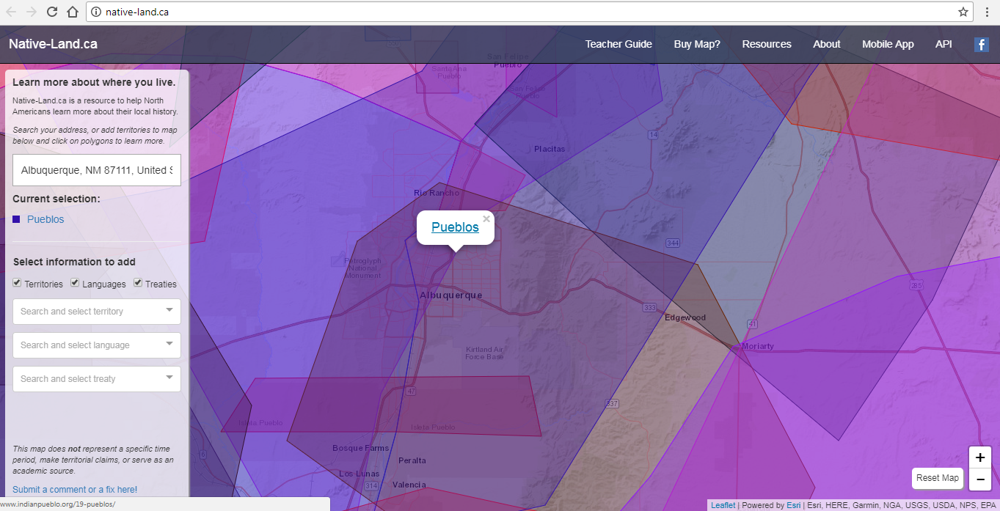

# Mapping Project Critique- [Native-Land.CA ](https://native-land.ca/)

Lorilei Chavez
 
Native Land, according to the founder Temperanova, is 'a [web app](https://github.com/tempranova/Native-Land/blob/master/README.md) with Google Maps API for mapping Indigenous territories, languages, and treaties across Turtle Island (North America).'

 
 
 ### Overview
 
The main functionality of the web app is to allow for user to enter a town or address to find out what Indigenous territories, languages, and treaties exist in current day North America. The goal of the web app is simply meant to sit on top of Google maps and provide a map of native land. The audience that this website is geared toward are North Americans interested in learning more about their local history. The site can also be applied within history classes or Indigenous studies courses as an educational resource or to create a discussion surrounding the information provided in the map. 

The main selections of the mapping web app are: the 'territories' option, the 'languages' option, and the 'treaties' option. 

In the 'Territories' option, users are able to view territories of Indigenous nations. Users are then able to select a certain area which will lead to a website from the tribe or the Wikipedia page of the tribe where the territory is located.
  

The same goes for the 'language' selection on the web app which also allows users to view languages of Indigenous people that exist in the North American hemisphere. Selecting a specific area's language will link users to *[Native-Land.org](http://www.native-languages.org/)* which is a third party website that specializes in Native languages.

  
 
 Lastly, the treaty selection displays many treaties that have affected Indigenous lands and people across North America. Also, in accordance with other selection features, it allows users to view treaties that have involved current lands and connects them to the *[National Park Service U.S Department of the Interior](https://www.nps.gov/nagpra/ONLINEDB/Land_Cessions/INDEX.HTM)'s* website which gives further information on Indian Land cessions. 
 
 
 ### Data

The data that is correlated to develop map web app is displayed on the [Resources](https://native-land.ca/resources.html) page of the site and displays links to the many different resources used to provide information on territories, languages, and treaties. The majority of links used to display 'languages' and 'territories' are from *[Native-Land.org](http://www.native-languages.org/)* which hosts information on both languages and territories of Indigenous people within North America. Additional data comes from websites of specific tribes or sites containing information specific to Indigenous languages and territories within North America. 

The information provided that makes up the data for the 'treaties' selection comes from a variety of many different sites which hosts maps of Indigenous lands or territories as well as when those lands were acquired which provided that data needed to give the parameters required to display the territory or treaty that allotted the land to tribes within the mapping tool.
 
  ### Critique
 
The usefulness of this web app for North Americans can be easily overshadowed by the interactive display of the map when a selection is made because the web app allows for many different colors delineate the territories, languages, and treaties. The web map app can also become confusing to the user if they began to try the many facets of the site. 
 
 
 
First, when imputing a zip code, the site will automatically zooms completely in to the area specified within the zip code selection which makes the areas selected very difficult to comprehend in a greater context because the zoom function does not allow you to see the territory, language, or treaty in relation to other areas.
 
 

Second, if the user were to select all three options available at one time, the map becomes overwhelmingly confusing because of the overload of data that is shown on the map. When all are selected it is hard to determine one selection from another and there are times when one map layer overlays a different map layer it makes the data or information on the selection unavailable or difficult to access.

Lastly, the site does include a teachers guide that was developed after the site developer recieved questions about being an educational resource. However, the 'teachers guide' does not offer much but having student discuss the website and give feedback which seems like more of a ploy to get input from users. If the guide include an example of an acutal lesson plan or rubric, then it can be useful for educators with a classroom context. 

 ### Final Thoughts
 
Overall, Native Land has allowed users to view North American adresseses and zip codes within an Indigenous perspective by overlaying territories, languages, and treaties on to familiar places which allows for futhur thought of history that has shaped local boundaries. Furthermore, it allows for acknowledgement of Indigenous peoples lands regardless oftreaties that allowed for relocation or allotment through crossreferencing language and terriorties. 

 

 
