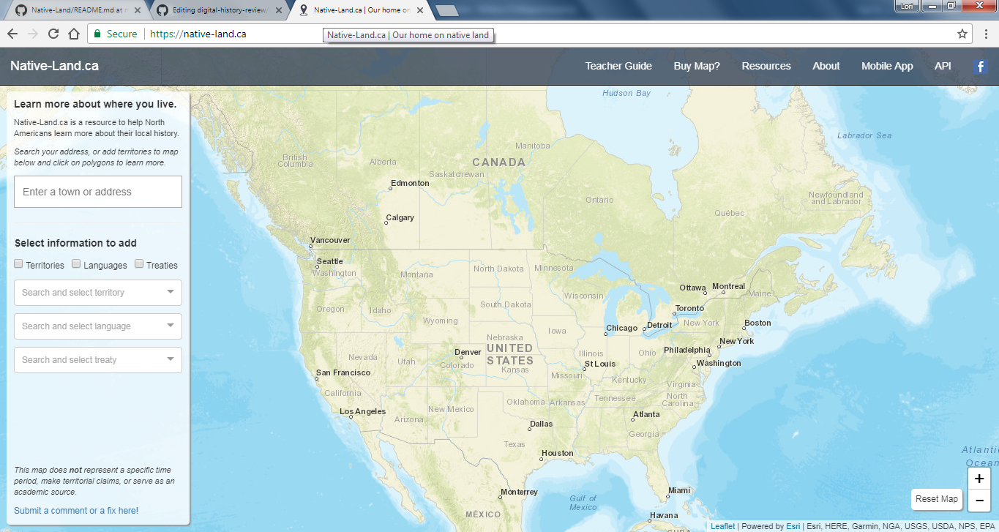
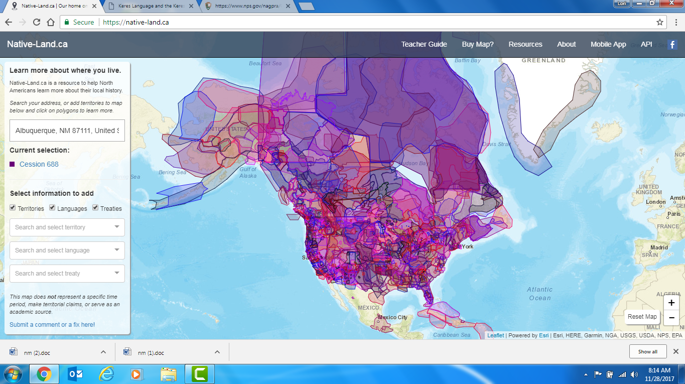
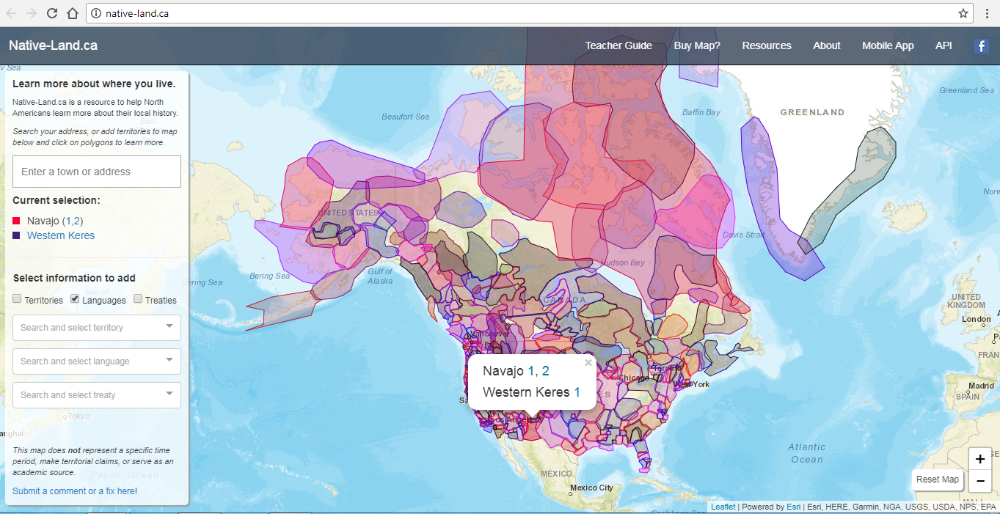
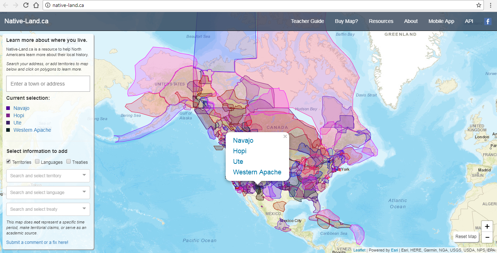
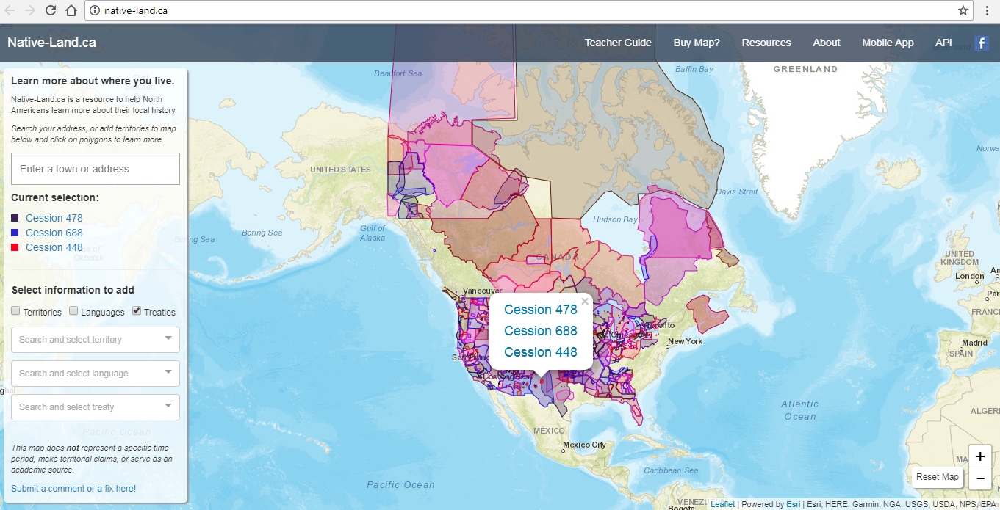

# Mapping Project Critique- [Native-Land.CA ](https://native-land.ca/)
 
 by Lorilei Chavez
 
Native Land is 'a [web app](https://github.com/tempranova/Native-Land/blob/master/README.md) with Google Maps API for mapping Indigenous territories, languages, and treaties across Turtle Island (North America). This app is simply meant to sit on top of Google maps and provide a map of native land.

 

 
 

 
 under construction 
 
 ### Design
 
 The design of this website is
 
 
 
 under construction 
 
 ### Database
 
 under construction 
 
 
 
 under construction 
 
 ### Validity
 
 under construction 
 
  
 
 ### Final Thoughts
 
 Overall, project is under construction 
